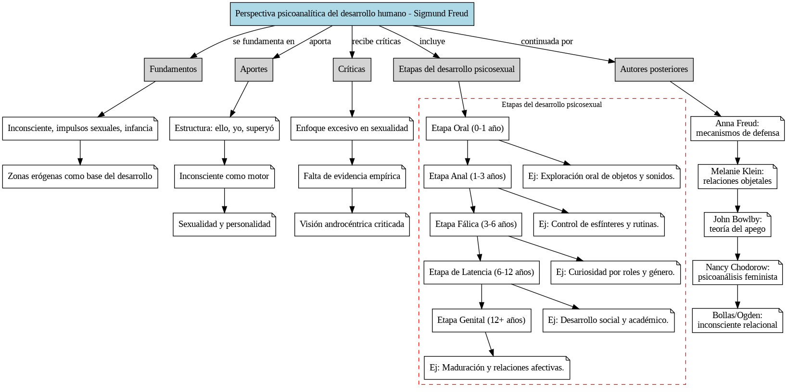

# CicloVital
proyecto de creación de mapas conceptuales para ciclo vital

Mapas Conceptuales de Teorías del Desarrollo

## Programa de Formación Pedagógica en Matemática

**Estudiantes:** Jorge Becar, Rodrigo Díaz, Sebastián Menares

## contexto
En el marco de la asignatura de ciclo vital, de acuerdo a lo visto en las clases y a la investigación realizada por el grupo se elaboraron scripts para dibujar mapas conceptuales de los contenidos.

Este proyecto contiene scripts de Python para dibujar mapas conceptuales de las teorías del desarrollo de Freud, Erikson y Kohlberg, utilizando la librería `graphviz`.

## Contenido

- `mapa_teoria_psicosexual_freud_mejorado.py`: Script para generar el mapa conceptual de la teoría psicosexual de Freud.
- `mapa_teoria_psicosocial_erikson_mejorado.py`: Script para generar el mapa conceptual de la teoría psicosocial de Erikson.
- `mapa_teoria_desarrollo_moral_kohlberg_mejorado.py`: Script para generar el mapa conceptual de la teoría del desarrollo moral de Kohlberg.
- `mapa_teorias_completo_vertical.py`: Script para generar un mapa conceptual que integra las tres teorías.
- `mapa_teoria_psicosexual_freud_mejorado.py`: Script para generar el mapa conceptual de la teoría psicosexual de Freud.  
  

- `mapa_teoria_psicosocial_erikson_mejorado.py`: Script para generar el mapa conceptual de la teoría psicosocial de Erikson.  
  

- `mapa_teoria_desarrollo_moral_kohlberg_mejorado.py`: Script para generar el mapa conceptual de la teoría del desarrollo moral de Kohlberg.  
  

- `mapa_teorias_completo_vertical.py`: Script para generar un mapa conceptual que integra las tres teorías.  
  
## Uso

Para dibujar los mapas conceptuales, simplemente ejecuta los scripts de Python. Se generarán archivos de imagen en formato PNG con los mapas conceptuales.
